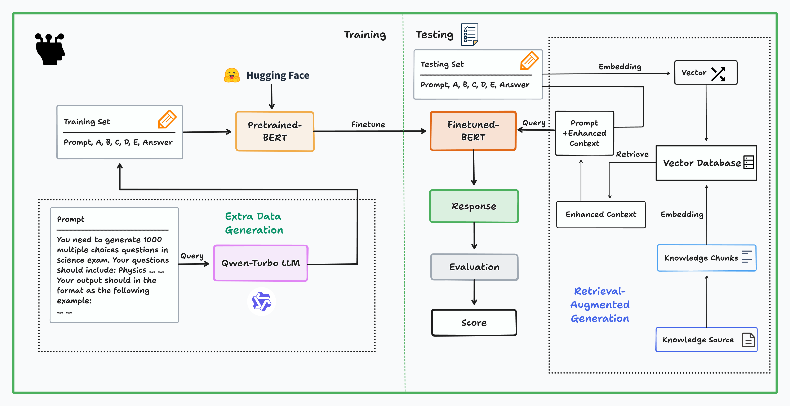

# AnsBob:  Answering LLM Science Exam Based on BERT 📝
## This repo is under construction

## Overview
This is a repository for our final course project in CSE3022M "Introduction to Big Data Analytics and Application".

The pipeline of our work:

## 0. Quick Start
### **Prepare your environment**

- Make sure you have installed CUDA and Pytorch.
- Install the environment by ``conda create env -f environment.yml``
- Run ``conda activate Ansbob``

### **Pre-process data**

If your does not have column named `id`, put your data at ``./data`` folder and run ``python process.py`` which will add ``'id'`` column to every csv file in this directory.

Or run``python process.py --data_dir /path/to/your/dataset_dir --output_dir /path/to/your/output_dir``
to specify your own directory.

Make sure your ``test.csv`` file header is :

``id,prompt,A,B,C,D,E``

And your ``test.csv`` file header is :

``id,prompt,A,B,C,D,E,answer``

### **Direct training**
By default, run ``python main.py``will out put a BERT model and its prediction towards test set, saved as ``submission.csv``.

### **Generate data by LLM**
If you want to generate your own question by LLM(Here take Qwen-plus model by default):

``python main.py --query``

### Customized
Here are full arguments for you to customize:

``--query``, whether you need to generate question from LLM; 

``--prompt_dir``, where your prompt file at;

``--train_dir``，where your training data at;

``--test_dir``, where your testing data at;

``--model_dir``，where your BERT model at;

## 1. Introduction
Inspired by Kaggle competition [LLM Science Exam](https://www.kaggle.com/competitions/kaggle-llm-science-exam), we build a language model that answer difficult science-based questions written by a Large Language Model.

## 2. Background
(From Kaggle)
### 2.1 Large Language Model
As the scope of large language model capabilities expands, a growing area of research is using LLMs to characterize themselves. Because many preexisting NLP benchmarks have been shown to be trivial for state-of-the-art models, there has also been interesting work showing that LLMs can be used to create more challenging tasks to test ever more powerful models.

### 2.2 Dataset
The dataset for this challenge was generated by giving gpt3.5 snippets of text on a range of scientific topics pulled from wikipedia, and asking it to write a multiple choice question (with a known answer), then filtering out easy questions.

Many thanks to [Radek Osmulski](https://www.kaggle.com/datasets/radek1/additional-train-data-for-llm-science-exam/data?select=6000_train_examples.csv)'s Dataset, we use his ``6000_train_set.csv`` as our training set, and his ``extra_train_set.csv`` as our testing set.

Also, we use Qwen API to generate more data.

## 3. Methodology

## 4. Experiment Result

## 5. Conclusion

## 6. Reference
[[1]Will Lifferth, Walter Reade, and Addison Howard. Kaggle - LLM Science Exam. https://kaggle.com/competitions/kaggle-llm-science-exam, 2023. Kaggle.](www.kaggle.com/competitions/kaggle-llm-science-exam/overview/$citation)